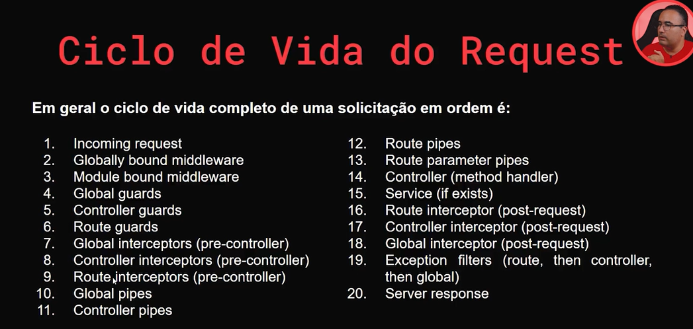
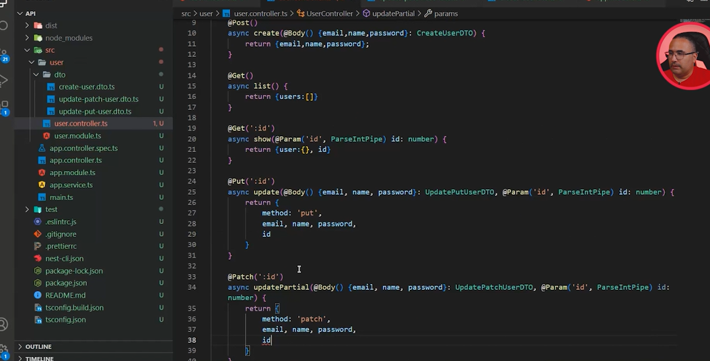
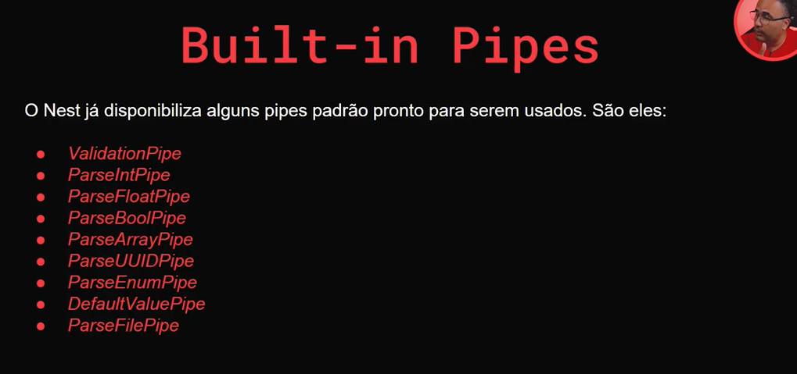
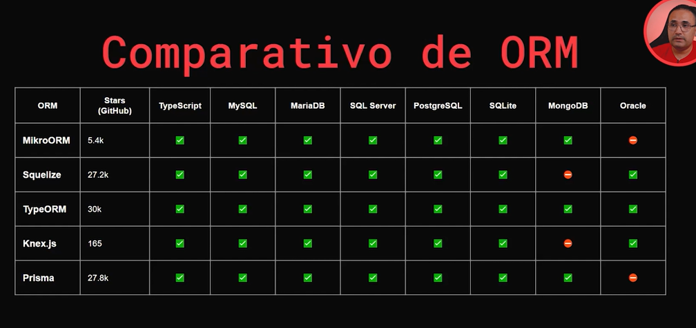
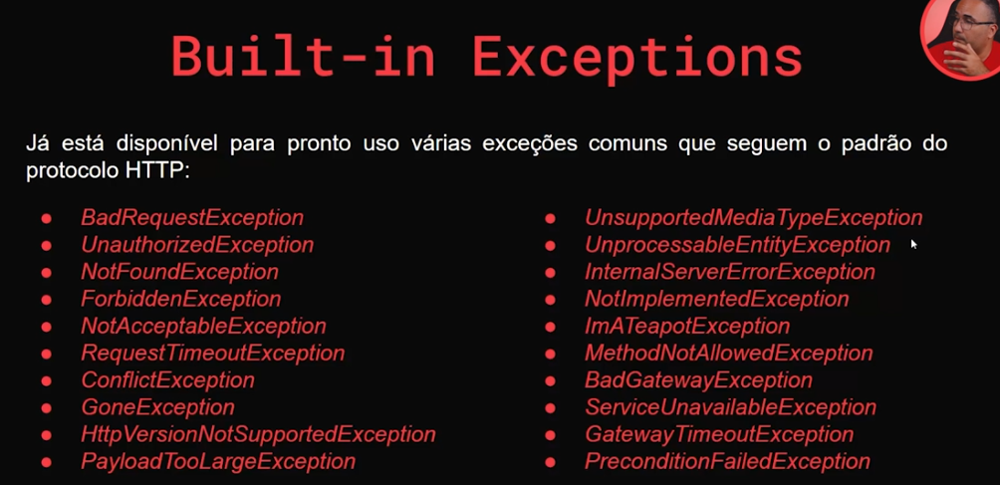

# NestJs

**REFERÊNCIAS:**

[Wesley Williams - Fullcycle](https://github.com/codeedu/nest-kafka/tree/master/apache-kafka)<br />
[Iago Maia - Medium](https://medium.com/@iago.maiasilva/construindo-uma-api-com-nestjs-postgresql-e-docker-parte-1-criando-nosso-primeiro-endpoint-248d4b8ecc9c)<br />
[Imersão Fullcycle](https://github.com/codeedu/live-imersao-fullcycle8-nestjs-clean-architecture)

## Pré requisitos

-   NodeJs ^14.15.0 || >= 16.10.0

## Instalar o CLI do NestJs

```bash
npm install -g @nestjs/cli
```

## Inicializar um projeto com NestJs

```bash
nest new nome-do-projeto
```

## Criar um módulo completo

```bash
# --no-spec impede de criar os arquivos de test
nest g res payments --no-spec
```

## Módulos para transpile

-   @swc/jest -D
-   @swc/core -D

## Para acelelar o transpile, necessário criar o arquivo .swcrc com o conteúdo:

```json
{
- "jsc": {
- - "parser": {
- - - "syntax": "typescript",
- - - "tsx": false,
- - - "decorators": true
- - },
- - "target": "es2017",
- - "keepClassNames": true,
- - "transform": {
- - - "legacyDecorator": true,
- - - "decoratorMetadata": true
- - }
- },
- "module": {
- - "type": "commonjs"
- }
}
```

## Para fazer uma validação profunda das tipagens

no arquivo tsconfig.json, adicionar a linha:

```json
{
- "strict": true
}
```

## Para instalar os pacotes e rodar o projeto

```bash
# Instalar os pacotes
yarn install

# Rodar o projeto
yarn start:dev
```

## Ciclo de vida request



## Parse Pipe Int na controller



## Alguns pipes existentes



## Comparativos de ORM



## Exceções nativas do NestJs



## Códigos de erros

-   CONTINUE = 100
-   SWITCHING_PROTOCOLS = 101
-   PROCESSING = 102
-   EARLYHINTS = 103
-   OK = 200
-   CREATED = 201
-   ACCEPTED = 202
-   NON_AUTHORITATIVE_INFORMATION = 203
-   NO_CONTENT = 204
-   RESET_CONTENT = 205
-   PARTIAL_CONTENT = 206
-   AMBIGUOUS = 300
-   MOVED_PERMANENTLY = 301
-   FOUND = 302
-   SEE_OTHER = 303
-   NOT_MODIFIED = 304
-   TEMPORARY_REDIRECT = 307
-   PERMANENT_REDIRECT = 308
-   BAD_REQUEST = 400
-   UNAUTHORIZED = 401
-   PAYMENT_REQUIRED = 402
-   FORBIDDEN = 403
-   NOT_FOUND = 404
-   METHOD_NOT_ALLOWED = 405
-   NOT_ACCEPTABLE = 406
-   PROXY_AUTHENTICATION_REQUIRED = 407
-   REQUEST_TIMEOUT = 408
-   CONFLICT = 409
-   GONE = 410
-   LENGTH_REQUIRED = 411
-   PRECONDITION_FAILED = 412
-   PAYLOAD_TOO_LARGE = 413
-   URI_TOO_LONG = 414
-   UNSUPPORTED_MEDIA_TYPE = 415
-   REQUESTED_RANGE_NOT_SATISFIABLE = 416
-   EXPECTATION_FAILED = 417
-   I_AM_A_TEAPOT = 418
-   MISDIRECTED = 421
-   UNPROCESSABLE_ENTITY = 422
-   FAILED_DEPENDENCY = 424
-   PRECONDITION_REQUIRED = 428
-   TOO_MANY_REQUESTS = 429
-   INTERNAL_SERVER_ERROR = 500
-   NOT_IMPLEMENTED = 501
-   BAD_GATEWAY = 502
-   SERVICE_UNAVAILABLE = 503
-   GATEWAY_TIMEOUT = 504
-   HTTP_VERSION_NOT_SUPPORTED = 505

\* Imagens por João Rangel
